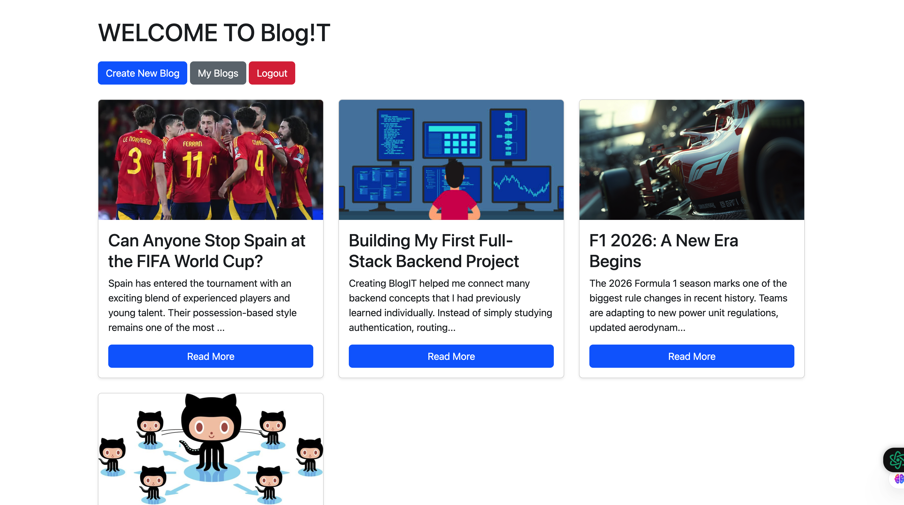

📝 BlogIT

A full-stack blogging platform built with Node.js, Express.js, MongoDB Atlas, and EJS.

My first full-fledged backend project focused on authentication, authorization, CRUD operations, MongoDB, and deployment.

🌐 Live Demo

🔗 https://blogit-91c0.onrender.com/login

💻 GitHub Repository

🔗 https://github.com/kaesh0/BlogIT

⸻

📸 Preview

⸻

✨ Features

* User Registration & Login
* Password hashing using bcrypt
* Session-based Authentication using Cookies
* Authorization (users can edit/delete only their own blogs)
* CRUD Operations
* Image Uploads using Multer
* Mongoose Populate
* createdAt & updatedAt timestamps
* Responsive UI using Bootstrap
* MongoDB Atlas Database
* Deployed on Render

⸻

🛠 Tech Stack

Backend

* Node.js
* Express.js
* MongoDB Atlas
* Mongoose

Frontend

* EJS
* Bootstrap

Authentication

* bcrypt
* Cookie Parser
* Session-based Authentication

Deployment

* Render

⸻

📂 Folder Structure

controller/
middleware/
models/
routes/
services/
views/
uploads/

⸻

🚀 Getting Started

git clone https://github.com/kaesh0/BlogIT.git
cd BlogIT
npm install
npm run dev

Create a .env file:

MONGO_URI=your_connection_string
PORT=3000

⸻

📚 What I Learned

This project strengthened my understanding of:

* MVC Architecture
* Routing
* Middleware
* Authentication
* Authorization
* REST APIs
* CRUD Operations
* MongoDB & Mongoose
* Multer
* Sessions & Cookies
* Git & GitHub
* Deployment with MongoDB Atlas & Render

⸻

⚠️ Note

This project stores uploaded images locally using Multer.

Since it is deployed on Render’s free tier, uploaded images may not persist after a redeploy or server restart because Render uses an ephemeral filesystem.

A production-ready version would use Cloudinary or Amazon S3 for image storage.

⸻

🔮 Future Improvements

* JWT Authentication
* React Frontend
* Cloudinary Integration
* User Profiles
* Comments
* Likes

⸻

⭐ If you found this project interesting, feel free to give it a star!